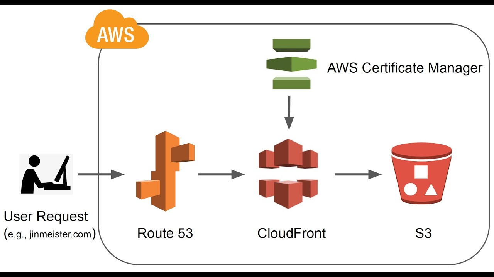

# Host a Website on AWS with a Custom Domain and HTTPS | S3, Route 53, CloudFront, Certificate Manager

https://www.youtube.com/watch?app=desktop&v=kvlSep7m7Uk&ab_channel=FelixYu 

## Deployment Workflow  
The diagram below illustrates the deployment process:  

