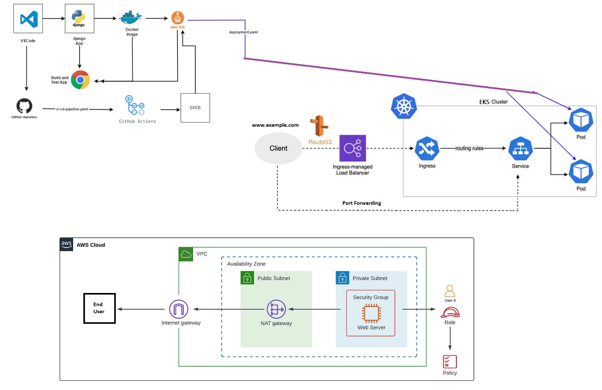

# Seminar_Cloud Computing (Nov 2024) at Air University Campus (GulberGreens, Islamabad)

# AWS Cloud Computing Seminar by: Basharat Hussain
### Duration: 3 to 4 hours live skill development session on AWS Cloud

## Seminar Goals  

### 1. AWS Identity and Access Management (IAM)  
- Understand the roles of the **Root User** and an **IAM User** (e.g., `TestUser_01`).  
- Explore AWS **Built-in Policies** and create **Custom Policies**.  
- Generate **Access Keys and Secret Keys** for programmatic access.  

### 2. Roles and Permissions  
- Learn **AWS STS AssumeRole** and permissions management.  
- Assign appropriate IAM permissions, such as:  
  - Full access to **EC2** instances.  
  - Full or partial access to **Amazon EKS** (Elastic Kubernetes Service).  

### 3. AWS Command-Line Interface (CLI)  
- Set up and configure the **AWS CLI** on **Ubuntu 24.04**.  
- Use CLI commands to interact with AWS services.  

### 4. Python Application Development  
- Build a Python application using **Django** and run it locally.  
- Push code to **GitHub** and set up **GitHub Actions** for a CI/CD pipeline.  

### 5. Containerization and Deployment  
- Create a **Dockerfile** for the Django application and run it locally using Docker.  
- Push the Docker image to **Amazon ECR** (Elastic Container Registry).  
- Deploy the application on **Amazon EKS**:  
  - Create an EKS cluster using CLI commands.  
  - Use **YAML files** for deployment, ingress configuration (with ELB), and services.  

### 6. Networking and Accessibility  
- Understand the EKS cluster **VPC architecture** in AWS Cloud.  
- Configure the ELB endpoint to route traffic using **Route 53**.  
- Alternatively, use **port forwarding** for EKS service access.  

### 7. CI/CD Integration  
- Implement a CI/CD pipeline to automate deployments to EKS Pods.  

### 8. Demonstration and Q&A  
- Showcase an end-to-end deployment on **EKS** using the CI/CD pipeline.  
- Conduct a Q&A session to address audience questions.  

---
## Deployment Workflow  
The diagram below illustrates the deployment process:  

### ⚡ Let's Build Cloud Solutions Together in following the 'Labs' folders!  
This seminar will guide you through hands-on implementation and live demos to master AWS Cloud Computing concepts. 
Feel free to ask questions or explore related topics during the session!  

