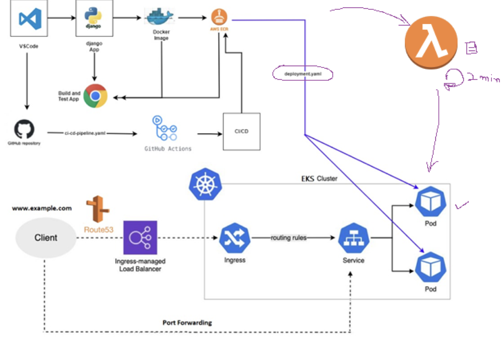

#### Seminar_Cloud Computing (Nov 2024) at Air University Campus (GulberGreens, Islamabad)
#### Duration: 3 to 4 hours live skill development session on AWS Cloud

# Cloud Computing Lab 01 - Seminar Overview (2024)

### Hosted by: **Basharat Hussain**  
**Software Architect | Industry Expert**  
📧 basharat.hussain@isb.nu.edu.pk  

---

## Deployment Workflow  
The diagram below illustrates the deployment process:  

---

## Motivation
The rapid adoption of cloud computing has revolutionized IT infrastructure by offering:
- **Scalability**, **Efficiency**, and **Cost-Effectiveness**.
  
However, effective utilization requires hands-on knowledge of cloud platforms, services, and tools.  
This seminar is designed to equip participants with **practical skills** for leveraging AWS Cloud services to build, manage, and deploy **scalable applications**.

---

## Objectives
1. **Enhance Cloud Proficiency**  
   Gain insights into AWS services like EC2, IAM, EKS, and ECR.
   
2. **Hands-On Practice**  
   Learn to create and manage cloud resources, deploy Django applications, and orchestrate containers.

3. **Promote Modern Development Practices**  
   Leverage Docker and Kubernetes for managing modern application architectures.

4. **Foster Automation**  
   Implement CI/CD pipelines for streamlined deployment workflows.

---

## Main Goals
By the end of this seminar, participants will:
- **Create and Configure Secure IAM Users and Policies**
- Use **AWS CLI** and **Docker** for application development and deployment.
- **Push and Manage Containerized Applications** on Amazon ECR.
- **Orchestrate Kubernetes Clusters** with Amazon EKS.
- **Build a Real-World Application**  
  Develop and deploy a **Django-based student management system** using Docker, ECR, and Kubernetes.
- **Integrate AWS Best Practices**  
  Implement **Infrastructure as Code (IaC)** using `eksctl` and YAML configurations.
- **Optimize Deployment**  
  Set up GitHub-hosted CI/CD workflows.

---

## Achievements
Participants will:
- Successfully build and deploy a **scalable web application**.
- Gain expertise in **cloud-based DevOps tools and workflows**.
- Learn secure access management and containerized application orchestration.
- Execute an **end-to-end cloud infrastructure** for real-world scenarios.

---

## Topics Covered
- **AWS IAM and EC2 Basics**
- **Docker and Containerization**
- **Deploying on Amazon ECR and EKS**
- **CI/CD Pipeline Implementation**

---

## Key Takeaways
- Hands-on experience with **cloud resource management**.
- Best practices in **cloud security** and **deployment automation**.
- Real-world application: **Django Student Management System**.

---

## Resources
- [AWS CLI Documentation](https://docs.aws.amazon.com/cli/latest/userguide/cli-chap-welcome.html)
- [Docker Documentation](https://docs.docker.com/)
- [Kubernetes Documentation](https://kubernetes.io/docs/)
- [GitHub CI/CD Guide](https://docs.github.com/en/actions)

---

## Example Workflow
An example of the seminar lab includes:
1. Creating an **IAM User** and setting up **AWS CLI**.
2. Developing a **Django-based application**.
3. Dockerizing and deploying the app to **Amazon ECR**.
4. Setting up an **EKS Cluster** for Kubernetes orchestration.
5. Implementing a **CI/CD Pipeline** using GitHub Actions.

---

### For more information, contact:  
**Basharat Hussain** 📧 basharat.hussain@isb.nu.edu.pk

## Seminar Steps  

### 1. AWS Identity and Access Management (IAM)  
- Understand the roles of the **Root User** and an **IAM User** (e.g., `TestUser_01`).  
- Explore AWS **Built-in Policies** and create **Custom Policies**.  
- Generate **Access Keys and Secret Keys** for programmatic access.  

### 2. Roles and Permissions  
- Learn **AWS STS AssumeRole** and permissions management.  
- Assign appropriate IAM permissions, such as:  
  - Full access to **EC2** instances.  
  - Full or partial access to **Amazon EKS** (Elastic Kubernetes Service).  

### 3. AWS Command-Line Interface (CLI)  
- Set up and configure the **AWS CLI** on **Ubuntu 24.04**.  
- Use CLI commands to interact with AWS services.  

### 4. Python Application Development  
- Build a Python application using **Django** and run it locally.  
- Push code to **GitHub** and set up **GitHub Actions** for a CI/CD pipeline.  

### 5. Containerization and Deployment  
- Create a **Dockerfile** for the Django application and run it locally using Docker.  
- Push the Docker image to **Amazon ECR** (Elastic Container Registry).  
- Deploy the application on **Amazon EKS**:  
  - Create an EKS cluster using CLI commands.  
  - Use **YAML files** for deployment, ingress configuration (with ELB), and services.  

### 6. Networking and Accessibility  
- Understand the EKS cluster **VPC architecture** in AWS Cloud.  
- Configure the ELB endpoint to route traffic using **Route 53**.  
- Alternatively, use **port forwarding** for EKS service access.  

### 7. CI/CD Integration  
- Implement a CI/CD pipeline to automate deployments to EKS Pods.  

### 8. Demonstration and Q&A  
- Showcase an end-to-end deployment on **EKS** using the CI/CD pipeline.  
- Conduct a Q&A session to address audience questions.  

---
### ⚡ Let's Build Cloud Solutions Together in following the 'Labs' folders!  
This seminar will guide you through hands-on implementation and live demos to master AWS Cloud Computing concepts. 
Feel free to ask questions or explore related topics during the session!  

